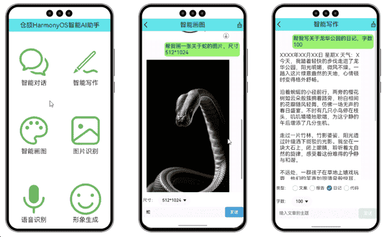
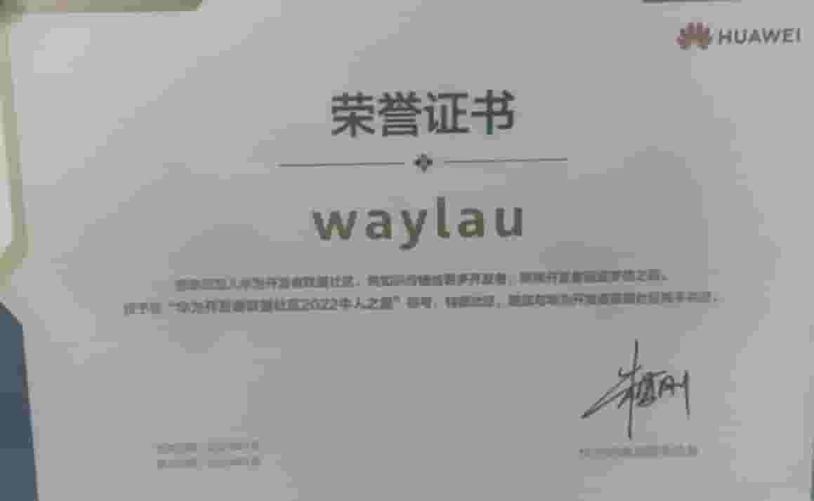
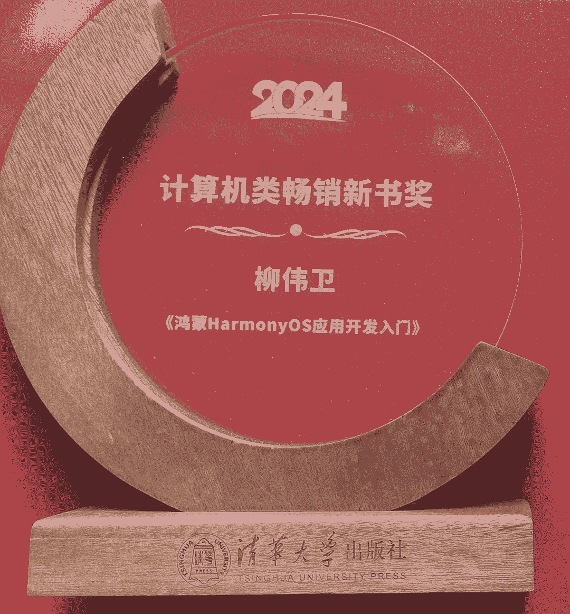
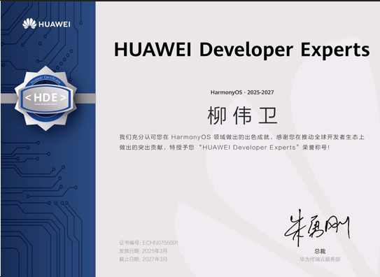
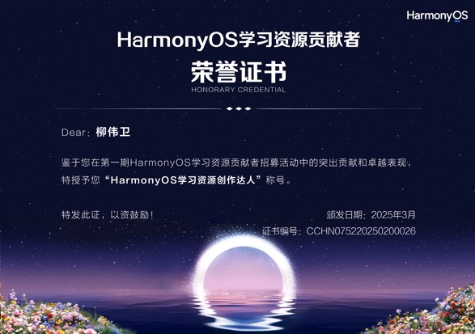
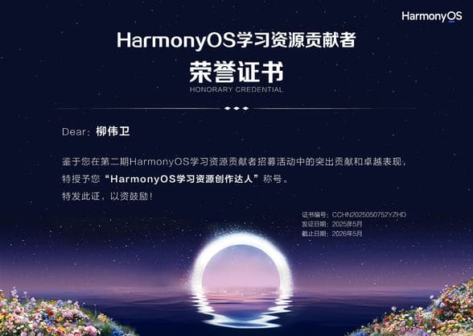

# HarmonyOS Tutorial. 《跟老卫学HarmonyOS开发》《鸿蒙HarmonyOS手机应用开发实战》《鸿蒙HarmonyOS应用开发从入门到精通》《鸿蒙HarmonyOS应用开发入门》《鸿蒙之光HarmonyOS NEXT原生应用开发入门》源码

*HarmonyOS Tutorial*, is a book about how to develop HarmonyOS applications.

《跟老卫学HarmonyOS开发》是一本 HarmonyOS 应用开发的开源学习教程，主要介绍如何从0开始开发 HarmonyOS 应用。本书包括最新版本HarmonyOS NEXT（HarmonyOS 5）中的新特性。图文并茂，并通过大量实例带你走进 HarmonyOS 的世界！

本书业余时间所著，书中如有错漏之处，敬请斧正，欢迎读者与笔者联系。

对于仓颉应用开发，请参阅《[跟老卫学仓颉编程语言开发](https://github.com/waylau/cangjie-programming-language-tutorial)》。

## Summary 目录

* [什么是鸿蒙、OpenHarmony、HarmonyOS](https://waylau.com/what-is-harmonyos/)
* [HarmonyOS初探01——下载安装DevEco Studio](https://developer.huawei.com/consumer/cn/forum/topic/0201427672244370691?fid=0101303901040230869)
* [HarmonyOS初探02——开发第一个HarmonyOS应用](https://developer.huawei.com/consumer/cn/forum/topic/0201427689906950692?fid=0101303901040230869)
* [HarmonyOS初探03——DevEco Studio创建应用问题ERROR Unable to tunnel through proxy. Proxy returns HTTP1.1 403](https://developer.huawei.com/consumer/cn/forum/topic/0201428884516950010?fid=0101303901040230869)
* [HarmonyOS初探04——使用DevEco Studio时设置Gradle仓库镜像](https://developer.huawei.com/consumer/cn/forum/topic/0201428885863380011?fid=0101303901040230869)
* [HarmonyOS初探05——内网环境下使用DevEco Studio模拟器](https://developer.huawei.com/consumer/cn/forum/topic/0201428886771250012?fid=0101303901040230869)
* [HarmonyOS初探06——使用DevEco Studio模拟器端口被占用无法启动](https://developer.huawei.com/consumer/cn/forum/topic/0204428887502690016?fid=0101303901040230869)
* [HarmonyOS初探07——使用DevEco Studio预览器](https://developer.huawei.com/consumer/cn/forum/topic/0201442998449480482?fid=0101303901040230869)
* [DevEco Studio 2.0.12.201使用报错“This device type does not match the module profile.”](https://developer.huawei.com/consumer/cn/forum/topic/0201435470610010153?fid=26)
* [DevEco Studio 启用Java预览器](https://developer.huawei.com/consumer/cn/forum/topic/0201663534596920806?fid=0101591351254000314)
* [HarmonyOS之Ability01——AbilitySlice间导航](https://developer.huawei.com/consumer/cn/forum/topic/0202443001580950502?fid=0101303901040230869)
* [HarmonyOS之线程01——ParallelTaskDispatcher派发任务](https://developer.huawei.com/consumer/cn/forum/topic/0204460939630370009?fid=0101303901040230869)
* [HarmonyOS之线程02——EventHandler处理线程间通信](https://developer.huawei.com/consumer/cn/forum/topic/0204461048552100015?fid=0101303901040230869)
* [获取图像属性失败！java.lang.IllegalStateException: image data source invalid](https://developer.huawei.com/consumer/cn/forum/topic/0201481849198120096?fid=0101303901040230869&pid=0301492195334980932)
* [只要5分钟开发一个HarmonyOS鸿蒙应用——HelloWorld](https://www.bilibili.com/video/BV1Qh411U7Go?share_source=copy_web)（视频）
* [HarmonyOS Page与AbilitySlice生命周期](https://developer.huawei.com/consumer/cn/forum/topic/0202573163094170174?fid=0101303901040230869)
* [理解HarmonyOS Service Ability](https://developer.huawei.com/consumer/cn/forum/topic/0202578737701770050?fid=0101303901040230869)
* [一个HarmonyOS Service Ability生命周期的例子](https://developer.huawei.com/consumer/cn/forum/topic/0201578738626200065?fid=0101303901040230869)
* [理解HarmonyOS Data Ability](https://developer.huawei.com/consumer/cn/forum/topic/0204578739122210072?fid=0101303901040230869)
* [HarmonyOS DataAbilityHelper访问文件的例子](https://developer.huawei.com/consumer/cn/forum/topic/0202578740019440052?fid=0101303901040230869)
* [HarmonyOS DataAbilityHelper访问数据库的例子](https://developer.huawei.com/consumer/cn/forum/topic/0202578740728040053?fid=0101303901040230869)
* [理解HarmonyOS Intent ](https://developer.huawei.com/consumer/cn/forum/topic/0202578742549140054?fid=0101303901040230869)
* [使用Java轻松实现一个HarmonyOS服务卡片](https://developer.huawei.com/consumer/cn/forum/topic/0201592758640690342?fid=0101303901040230869)
* [HarmonyOS实现跨设备迁移与回迁](https://developer.huawei.com/consumer/cn/forum/topic/0201628139884080274?fid=0101303901040230869)
* [HarmonyOS实现多设备协同](https://developer.huawei.com/consumer/cn/forum/topic/0201628168180890276?fid=0101303901040230869)
* [HarmonyOS跳转到系统应用拨号盘](https://developer.huawei.com/consumer/cn/forum/topic/0201659093603710707?fid=0101303901040230869)
* [HarmonyOS跳转到应用管理](https://developer.huawei.com/consumer/cn/forum/topic/0202660722259570963?fid=0101591351254000314)
* [HarmonyOS跳转到搜索](https://developer.huawei.com/consumer/cn/forum/topic/0202663401260600008?fid=0101591351254000314)
* [HarmonyOS跳转到指定URI进行访问](https://developer.huawei.com/consumer/cn/forum/topic/0201673625843820338?fid=0101591351254000314)
* [HarmonyOS的TextField的text_alignment属性值已经变更](https://developer.huawei.com/consumer/cn/blog/topic/03664410174460106)
* [HarmonyOS的vp、fp与Android的dp、sp联系与区别](https://developer.huawei.com/consumer/cn/forum/topic/0202669455953940178?fid=0101303901040230869)
* [HarmonyOS JS UI之Chart、 Switch组件的组合使用](https://developer.huawei.com/consumer/cn/forum/topic/0202678203858060455?fid=0101591351254000314)
* [HarmonyOS的Service、原子化服务、服务卡片的区别](https://developer.huawei.com/consumer/cn/forum/topic/0201681241634630549?fid=0101610563345550409)
* [HarmonyOS 多entry下应用启动报错“The type of the target device does not match the deviceType configured in the config.json”的解决](
https://developer.huawei.com/consumer/cn/forum/topic/0202692632918480755?fid=0101610563345550409)
* [HarmonyOS获取系统内存大小、可用内存](https://developer.huawei.com/consumer/cn/forum/topic/0202700471997530007?fid=0101591351254000314)
* [#HarmonyOS挑战赛第二期#仿抖音短视频应用](
https://developer.huawei.com/consumer/cn/forum/topic/0201692989697260758?fid=0101303901040230869)
* [#HarmonyOS挑战赛第三期#“心目中的1024程序员节”爱“HarmonyOS”](https://developer.huawei.com/consumer/cn/forum/topic/0201697127022460928?fid=0101587866109860105)
* [DevEco Studio打开Codelabs示例报“Unknown host '不知道这样的主机。 (repo.ark.tools.huawei.com)'”错误的解决](https://developer.huawei.com/consumer/cn/forum/topic/0202700471997530007?fid=0101591351254000314)
* [#HarmonyOS技术训练营第三期#探探老婆在干嘛——通过HarmonyOS分布式文件获取对方手机内容](https://developer.huawei.com/consumer/cn/forum/topic/0203702299511520008?fid=0101591351254000314)
* [#HarmonyOS挑战赛第四期#使用ArkUI开发一个图片滑动播放功能HarmonyOS应用](https://developer.huawei.com/consumer/cn/forum/topic/0204705003425460081?fid=0101591351254000314)
* [#HarmonyOS征文#基于HarmonyOS ArkUI 3.0 框架，我成功开发了图片自动播放功能](https://developer.huawei.com/consumer/cn/forum/topic/0204705883233030129?fid=0101591351254000314)
* [什么叫做HarmonyOS“1+8+N”](https://developer.huawei.com/consumer/cn/forum/topic/0203715060368250074?fid=0101610563345550409)
* [基于HarmonyOS ArkUI 3.0 框架，开发了菜谱自动展播的应用](https://www.bilibili.com/video/BV1T34y1Z7X3/)（视频）
* [HarmonyOS离PC端有多远](https://developer.huawei.com/consumer/cn/forum/topic/0204726291294980583?fid=0101610563345550409)
* [HarmonyOS编程之路是知易行难，贵在坚持](https://developer.huawei.com/consumer/cn/forum/topic/0203727168139000447?fid=0101610563345550409)
* [15000积分兑换海思开发板Hi3518EV300 长啥样？！一起开箱看下，支持鸿蒙OS哦](https://developer.huawei.com/consumer/cn/forum/topic/0204729191116100676?fid=0103702273237500027)
* [OpenHarmony支持的系统类型以及对应的内核](https://developer.huawei.com/consumer/cn/forum/topic/0204729778972140718?fid=0103702273237490025)
* [解决DevEco Studio安装Ets SDK失败的问题](https://developer.huawei.com/consumer/cn/forum/topic/0201742704622820325?fid=26)
* [#HarmonyOS技术训练营第四期#使用ArkUI开发“仿WeLink打卡”HarmonyOS应用](https://developer.huawei.com/consumer/cn/forum/topic/0201742900461960432?fid=0101591351254000314)
* [使用ArkUI只需20行代码搞定“仿WeLink打卡”HarmonyOS应用](https://www.bilibili.com/video/BV15M4y1A7Vt/)（视频）
* [OpenHarmony HDC工具详解](https://developer.huawei.com/consumer/cn/forum/topic/0201763247640210925?fid=0103702273237520029)
* [华为开发者联盟社区2021年牛人之星](https://developer.huawei.com/consumer/cn/forum/topic/0201787443938940143)
* [以父之名·码力全开！写段HarmonyOS祝父亲节](https://developer.huawei.com/consumer/cn/forum/topic/0203909713809490254?fid=0101591351254000314)
* [#HarmonyOS技术训练营#AI来做HarmonyOS藏头诗应用](https://developer.huawei.com/consumer/cn/forum/topic/0204927609677810616?fid=0101591351254000314)
* [华为开发者联盟社区2022年度战码先锋1期开源贡献之星](https://developer.huawei.com/consumer/cn/forum/topic/0204957297101430449)
* [《鸿蒙生态应用开发白皮书》读后感，还是那熟悉的配方](https://developer.huawei.com/consumer/cn/forum/topic/0201103202674567076?fid=0101610563345550409)
* [#HarmonyOS体验官 玩转HarmonyOS 3必装DevEco Studio 3，注意避弹](https://developer.huawei.com/consumer/cn/forum/topic/0202103558349879153?fid=0101610563345550409)
* [#HarmonyOS体验官 用HarmonyOS ArkUI抽个盲盒头像](https://developer.huawei.com/consumer/cn/forum/topic/0202103570335932166?fid=0101591351254000314)
* [#HarmonyOS体验官【挑战赛第一期】用HarmonyOS ArkUI来开发一个购物应用程序](https://developer.huawei.com/consumer/cn/forum/topic/0202103750705507189?fid=0101587866109860105)、[视频](https://www.bilibili.com/video/BV1NG4y1o7rv/)
* [#HarmonyOS体验官【挑战赛第二期】用HarmonyOS ArkUI调用三方库PhotoView实现图片的联播、缩放](https://developer.huawei.com/consumer/cn/forum/topic/0202103760075502191?fid=0101591351254000314)、[视频](https://www.bilibili.com/video/BV1Rg411i7y1/)
* [#HarmonyOS体验官 【HarmonyOS ArkUI入门训练营】用HarmonyOS ArkUI来开发一个健康饮食应用](https://developer.huawei.com/consumer/cn/forum/topic/0202103820939502206?fid=0101591351254000314)
* [#HarmonyOS体验官【挑战赛第三期】用HarmonyOS ArkUI实现点赞美女翻牌动效](https://developer.huawei.com/consumer/cn/forum/topic/0201105240170004491)
* [#HarmonyOS体验官 HarmonyOS 3.1 Developer Preview新特性解读](https://developer.huawei.com/consumer/cn/forum/topic/0202105632577423558)
* [虽有HarmonyOS 3.1 Developer Preview，但想用3.0 Release版本怎么办？](https://developer.huawei.com/consumer/cn/forum/topic/0202105699819621571)
* [HarmonyOS ArkUI分布式数据服务开发](https://developer.huawei.com/consumer/cn/forum/topic/0201107105975570814)
* [HarmonyOS ArkUI关系型数据库开发](https://developer.huawei.com/consumer/cn/forum/topic/0201107109777137818)
* [HarmonyOS ArkUI首选项开发](https://developer.huawei.com/consumer/cn/forum/topic/0202107112558535813)
* [华为开发者联盟社区2022年牛人之星](https://developer.huawei.com/consumer/cn/forum/topic/0203109930647268095)
* [华为开发者联盟社区2022年度战码先锋2期开源贡献之星](https://developer.huawei.com/consumer/cn/forum/topic/0203110017942177099)
* [HarmonyOS应用在本地模拟器中运行](https://www.bilibili.com/video/BV1kG4y1Q765/)（视频）
* [HarmonyOS本地模拟器的使用](https://www.bilibili.com/video/BV1R84y1L783/)（视频）
* [HarmonyOS 3.1 Beta 1初体验，我在本地模拟器里面刷短视频](https://developer.huawei.com/consumer/cn/forum/topic/0204112795355581487)
* [HarmonyOS常用UI组件ToastDialog全面介绍及实操](https://developer.huawei.com/consumer/cn/forum/topic/0202115661867151329)
* [开发鸿蒙HarmonyOS版仿“抖音”App！](https://www.bilibili.com/video/BV1Fc411K7Uw/)（视频）
* [HarmonyOS版的“抖音”长啥样？有图有真相](https://developer.huawei.com/consumer/cn/forum/topic/0202118947187967814)
* [“鸿蒙系统实战短视频App 从0到1掌握HarmonyOS”实战课程已上线](https://developer.huawei.com/consumer/cn/blog/topic/03119094258031087)
* [开发鸿蒙HarmonyOS版仿“抖音”App-为什么学](https://www.bilibili.com/video/BV1gz4y1B744/)（视频）
* [开发鸿蒙HarmonyOS版仿“抖音”App-学什么](https://www.bilibili.com/video/BV1Do4y1g7Bm)（视频）
* [开发鸿蒙HarmonyOS版仿“抖音”App-怎么学](https://www.xiaohongshu.com/explore/647171c7000000001300d36c)（视频）
* [使用HarmonyOS  ArkTS创建元服务（上）](https://developer.huawei.com/consumer/cn/forum/topic/0209123429587384205)
* [使用HarmonyOS  ArkTS创建元服务（下）](https://developer.huawei.com/consumer/cn/forum/topic/0210123429701706203)
* [【以梦筑码 · 不负韶华】我伴随HarmonyOS一起成长](https://developer.huawei.com/consumer/cn/forum/topic/0208123985089505317?fid=0101587866109860105)
* [#HDC2023 心得分享#HarmonyOS应用开发的新机遇与挑战](https://developer.huawei.com/consumer/cn/forum/topic/0202126611589549374?fid=0101610563345550409)
* [基于HarmonyOS ArkUI实现音乐列表功能](https://developer.huawei.com/consumer/cn/forum/topic/0207128282721917372?fid=0101562279236410779)
* [基于HarmonyOS ArkUI实现七夕壁纸轮播](https://developer.huawei.com/consumer/cn/forum/topic/0209128602919619570?fid=0101591351254000314)
* [基于HarmonyOS低代码开发实现CPI图表](https://developer.huawei.com/consumer/cn/forum/topic/0207130176151650057?fid=0101591351254000314)
* [基于HarmonyOS ArkTS中秋国庆祝福程序](https://developer.huawei.com/consumer/cn/forum/topic/0201131193862897018?fid=0101591351254000314)
* [HarmonyOS 开发 Java 与 ArkTS 如何抉择](https://developer.huawei.com/consumer/cn/forum/topic/0203135735995709211?fid=0101610563345550409)
* [阿里入局鸿蒙！鸿蒙原生应用再添两员新丁](https://developer.huawei.com/consumer/cn/forum/topic/0203136159793226383?fid=0101610563345550409)
* [鸿蒙HarmonyOS应用新设备能跑老API开发的应用吗？](https://developer.huawei.com/consumer/cn/forum/topic/0204136335226928311?fid=0101610563345550409)
* [小红书已完成#鸿蒙原生应用#Beta版本开发](https://developer.huawei.com/consumer/cn/forum/topic/0204136336646227312?fid=0101610563345550409)
* [鸿蒙原生应用再添两员新丁！​B站、58入局鸿蒙](https://developer.huawei.com/consumer/cn/forum/topic/0203136806231462640?fid=0101610563345550409)
* [鸿蒙原生应用再添新丁！高德地图入局鸿蒙](https://developer.huawei.com/consumer/cn/forum/topic/0204136892240995558?fid=0101610563345550409)
* [鸿蒙原生应用再添新丁！麦当劳中国入局鸿蒙](https://developer.huawei.com/consumer/cn/forum/topic/0204137287597648714?fid=0101610563345550409)
* [轻松掌握ArkTS！鸿蒙新作《鸿蒙HarmonyOS应用开发入门》简介](https://developer.huawei.com/consumer/cn/forum/topic/0204137371596828763?fid=0101610563345550409)
* [鸿蒙原生应用再添新丁！支付宝入局鸿蒙](https://developer.huawei.com/consumer/cn/forum/topic/0201137460532479009?fid=0101610563345550409)
* [轻松掌握ArkTS！鸿蒙新作《鸿蒙HarmonyOS应用开发入门》开箱](https://www.bilibili.com/video/BV1ee411o7XE)（视频）
* [鸿蒙原生应用再添新丁！同花顺入局鸿蒙](https://developer.huawei.com/consumer/cn/forum/topic/0201137715493130041?fid=0101610563345550409)
* [鸿蒙原生应用再添新丁！网易游戏入局鸿蒙](https://developer.huawei.com/consumer/cn/forum/topic/0204138063180278909?fid=0101610563345550409)
* [鸿蒙原生应用再添新丁！米哈游入局鸿蒙](https://developer.huawei.com/consumer/cn/forum/topic/0202138316368453170)
* [【画龙迎春】纯血鸿蒙来画龙！基于HarmonyOS ArkTS来操作SVG图片](https://developer.huawei.com/consumer/cn/forum/topic/0203143920386713714)
* [当新版DevEco Studio打开老版HarmonyOS应用报错解决](https://www.bilibili.com/video/BV1bC411n7Lr/)（视频）
* [“2024鸿蒙零基础快速实战-仿抖音App开发（ArkTS版）”实战课程已上线](https://waylau.com/harmonyos-short-video-arkts/)
* [ArkTS开发原生鸿蒙HarmonyOS短视频应用](https://www.bilibili.com/video/BV1KD421M7a8/)（视频）
* [2024鸿蒙零基础快速实战-仿抖音App开发(ArkTS版)-课程导学](https://www.bilibili.com/video/BV11D421K7Cd/)（视频）
* [HarmonyOS 3.1/4.0应用升级到HarmonyOS NEXT改动点](https://waylau.com/changes-upgrade-from-3-1-4-0-to-harmonyos-next-developer-preview2)
* [DevEco Studio NEXT Developer Beta3打开NEXT Developer Preview2应用报错问题解决](https://waylau.com/upgrade-from-harmonyos-next-developer-preview2-to-next-developer-beta3/)
* [HarmonyOS NEXT仓颉编程语言开发环境搭建（安装DevEco Studio Cangjie Plugin）](https://waylau.com/install-deveco-studio-cangjie-plugin/)
* [HarmonyOS ArkTS用户首选项的开发及测试](https://developer.huawei.com/consumer/cn/forum/topic/0212162121584279891?fid=0109140870620153026)
* [HarmonyOS NEXT Release版本发布](https://developer.huawei.com/consumer/cn/forum/topic/0202163790773265911?fid=0109140870620153026)
* [原生鸿蒙操作系统HarmonyOS NEXT（HarmonyOS 5）正式发布](https://developer.huawei.com/consumer/cn/forum/topic/0201165020167549746?fid=0109140870620153026)
* [DevEco Studio 5.0.1 Beta3安装及配置](https://developer.huawei.com/consumer/cn/forum/topic/0201167060557489345)
* [HarmonyOS 3.1/4项目在DevEco Studio 5.0（HarmonyOS NEXT）版本下使用的问题](https://waylau.com/deveco-studio-5-develop-harmonyos-3/)
* [《鸿蒙HarmonyOS应用开发从入门到精通（第2版）》简介](https://waylau.com/about-harmonyos-application-development-from-zero-to-hero-2nd-edition-book/)
* [仓颉开发HarmonyOS，报错error: undeclared identifier 'ViewStackProcessor'](https://developer.huawei.com/consumer/cn/forum/topic/0203168734455974805)
* [仓颉开发HarmonyOS，@Builder 和@Component的区别？](https://developer.huawei.com/consumer/cn/forum/topic/0201168738273407796)
* [仓颉开发HarmonyOS，internal import 和import 有什么区别？	](https://developer.huawei.com/consumer/cn/forum/topic/0201168738630513798)
* [市面上最厚的鸿蒙著作！《鸿蒙HarmonyOS应用开发从入门到精通（第2版）》](https://www.bilibili.com/video/BV1N2ktYeEBd/)（视频）
* [HarmonyOS产生的背景](https://developer.huawei.com/consumer/cn/forum/topic/0203170498345755621?fid=0109140870620153026)
* [HarmonyOS技术理念](https://developer.huawei.com/consumer/cn/forum/topic/0202170671991846041?fid=0109140870620153026)
* [《鸿蒙之光HarmonyOS NEXT原生应用开发入门》简介](https://waylau.com/about-harmonyos-next-tutorial-book/)
* [HarmonyOS架构介绍](https://developer.huawei.com/consumer/cn/forum/topic/0202171014436926490)
* [纯血鸿蒙！《鸿蒙之光HarmonyOS NEXT原生应用开发入门》](https://www.bilibili.com/video/BV11cCpYXEyL/)（视频）
* [HarmonyOS纯血鸿蒙新特性](https://developer.huawei.com/consumer/cn/forum/topic/0204171533399971963?fid=0109140870620153026)
* [HarmonyOS环境搭建之注册华为开发者联盟帐号](https://developer.huawei.com/consumer/cn/forum/topic/0202172141875455029?fid=0109140870620153026)
* [DevEco Studio 3.1/4 下载安装](https://developer.huawei.com/consumer/cn/forum/topic/0202172750026769021)
* [DeepSeek火出圈，国货当自强！HarmonyOS就是原生智能系统](https://developer.huawei.com/consumer/cn/forum/topic/0203174136422203503?fid=0109140870620153026)
* [原生鸿蒙版小艺APP接入DeepSeek-R1，为HarmonyOS应用开发注入新活力](https://www.imooc.com/article/378306)
* [鸿蒙原生应用再添新丁！北京广电、充电管家、有我帮 入局鸿蒙](https://developer.huawei.com/consumer/cn/forum/topic/0203175158162669774?fid=0109140870620153026)
* [HarmonyOS使用系统图标](https://www.imooc.com/article/378837)
* [HarmonayOS通过应用链接拉起指定应用](https://waylau.com/harmonyos-open-app-with-deep-linking/)
* [华为鸿蒙PC要来了？](https://developer.huawei.com/consumer/cn/blog/topic/03177612448714040)
* [“HarmonyOS NEXT+AI大模型打造智能助手APP(仓颉版)”实战课程简介](https://waylau.com/develop-native-harmonyos-ai-assistant-with-cangjie-video/)
* [HarmonyOS 5 时代已来！华为首款阔折叠屏 Pura X 发布，开发者如何抢占未来生态红利？](https://developer.huawei.com/consumer/cn/forum/topic/0207177872217215165?fid=0109140870620153026)
* [如何亲手打造AI智能助手APP？项目效果演示](https://www.bilibili.com/video/BV15zXeYfEdY)（视频）
* [仓颉编程语言还能这么玩？HarmonyOS NEXT+AI大模型打造智能助手APP](https://developer.huawei.com/consumer/cn/forum/topic/0204178189326184176?fid=0109140870620153026)
* [谷歌将 Android OS 转为 “内部开发”，对鸿蒙系统来说是否是个机会？](https://developer.huawei.com/consumer/cn/forum/topic/0204178542373267294?fid=0109140870620153026)
* [人民日报批安卓假开源真垄断，鸿蒙系统或转正](https://www.imooc.com/article/379847)
* [华为2024年报：鸿蒙生态正在取得历史性突破](https://developer.huawei.com/consumer/cn/forum/topic/0204178880836982377?fid=0109140870620153026)
* [鸿蒙生态日日新：“郑好办”鸿蒙版上线，今日头条、人民日报等更新](https://developer.huawei.com/consumer/cn/blog/topic/03179484239808023)
* [【HarmonyOS NEXT+AI】问答01：课程里用的什么大模型？能用DeepSeek吗？](https://developer.huawei.com/consumer/cn/forum/topic/0202179567792367460?fid=0109140870620153026)
* [科技巨头加倍押注生成式 AI](https://developer.huawei.com/consumer/cn/forum/topic/0207179667509011509?fid=23)
* [【HarmonyOS NEXT+AI】问答02：有一点编程基础，可以学不？](https://developer.huawei.com/consumer/cn/forum/topic/0207179750550660521?fid=0109140870620153026)
* [【HarmonyOS NEXT+AI】问答03：找不到DevEco Studio Cangjie Plugin下载链接？](https://developer.huawei.com/consumer/cn/forum/topic/0207180264471291591?fid=0109140870620153026)
* [【HarmonyOS NEXT+AI】问答04：仓颉编程语言适合毕业设计吗？
](https://developer.huawei.com/consumer/cn/forum/topic/0201181154070287038?fid=0109140870620153026)
* [#我的鸿蒙开发手记#从0到1如何踏上HarmonyOS之旅](https://ost.51cto.com/posts/33218)
* [华为首款鸿蒙电脑正式亮相](https://developer.huawei.com/consumer/cn/forum/topic/0202182086290078559?fid=0109140870620153026)
* [【HarmonyOS NEXT+AI】问答05：ArkTS和仓颉编程语言怎么选？](https://developer.huawei.com/consumer/cn/forum/topic/0204182208074587445?fid=0109140870620153026)
* [HarmonyOS NEXT+AI打造智能助手APP（适配DeepSeek）](https://developer.huawei.com/consumer/cn/forum/topic/0201182544745864038?fid=0109140870620153026)
* [鸿蒙电脑的诞生是国产操作系统的破壁之战](https://developer.huawei.com/consumer/cn/forum/topic/0202183593464049037?fid=0109140870620153026)
* [给鸿蒙PC和胖折叠Pura X写程序是什么体验](https://www.bilibili.com/video/BV1AE76z5Ei8/)（视频）
* [API 15实战案例：新晋导航点组件Indicator详解](https://harmonyosdev.csdn.net/683c14e3965a29319f248ec0.html)
* [HarmonyOS API 15 Swiper动效模式SwiperAnimationMode应用展示](https://developer.huawei.com/consumer/cn/forum/topic/0207186048437968004?fid=0109140870620153026)
* [华为自研仓颉编程语言将开源，未来与ArkTS同等地位](https://developer.huawei.com/consumer/cn/forum/topic/0210186139141263055?fid=0109140870620153026)
* 未完待续...

## Samples 示例

* [Hello World](samples/HelloWorld)
* [多个AbilitySlice之间的路由与导航](samples/AbilitySliceNavigation)
* [Page与AbilitySlice生命周期的例子](samples/PageAndAbilitySliceLifeCycle)
* [Service Ability生命周期的例子](samples/ServiceAbilityLifeCycle)
* [DataAbilityHelper访问文件](samples/DataAbilityHelperAccessFile)
* [DataAbilityHelper访问数据库](samples/DataAbilityHelperAccessDatabase)
* [多个Page之间的路由与导航](samples/IntentOperationWithAction)
* [启动系统应用拨号盘](samples/IntentOperationWithActionDial)
* [跳转到应用管理](samples/IntentOperationWithActionManageApplicationsSettings)
* [跳转到搜索](samples/IntentOperationWithActionSearch)
* [跳转到指定URI进行访问](samples/IntentOperationWithUri)
* [分布式任务调度启动远程FA](samples/DistributedSchedulingStartRemoteFA)
* [分布式任务调度启动和关闭远程PA](samples/DistributedSchedulingStartStopRemotePA)
* [公共事件服务发布事件](samples/CommonEventPublisher)
* [公共事件服务订阅事件](samples/CommonEventSubscriber)
* [高级通知服务](samples/Notification)
* [剪切板数据的写入](samples/SystemPasteboardSetter)
* [剪切板数据的读取](samples/SystemPasteboardGetter)
* [XML创建布局](samples/DirectionalLayoutWithXml)
* [Java创建布局](samples/DirectionalLayoutWithJava)
* [常用显示类组件——Text](samples/Text)
* [常用显示类组件——Image](samples/Image)
* [常用显示类组件——ProgressBar](samples/ProgressBar)
* [常用交互类组件——Button](samples/Button)
* [常用交互类组件——Slider](samples/Slider)
* [常用交互类组件——TextField](samples/TextField)
* [常用交互类组件——Checkbox](samples/Checkbox)
* [常用交互类组件——RadioButton/RadioContaine](samples/RadioButtonRadioContaine)
* [常用交互类组件——Switch](samples/Switch)
* [常用交互类组件——ScrollView](samples/ScrollView)
* [常用交互类组件——Tab/TabList](samples/TabList)
* [常用交互类组件——Picker](samples/Picker)
* [常用交互类组件——ListContainer](samples/ListContainer)
* [常用交互类组件——RoundProgressBar](samples/RoundProgressBar)
* [常用交互类组件——PageSlider](samples/PageSlider)
* [常用交互类组件——CommonDialog](samples/CommonDialog)
* [常用交互类组件——ToastDialog](samples/ToastDialog)
* [常用布局——DirectionalLayout](samples/DirectionalLayout)
* [常用布局——DependentLayout](samples/DependentLayout)
* [常用布局——StackLayout](samples/StackLayout)
* [常用布局——TableLayout](samples/TableLayout)
* [常用布局——PositionLayout](samples/PositionLayout)
* [常用布局——AdaptiveBoxLayout](samples/AdaptiveBoxLayout)
* [创建JS FA应用](samples/JsFa)
* [点赞按钮](samples/GiveLike)
* [JS FA调用PA](samples/JsFaCallPa)
* [JS UI之Chart、 Switch组件的组合使用](samples/JsChartSwitch)
* [多模输入事件](samples/MultimodalEvent)
* [线程管理示例](samples/ParallelTaskDispatcher)
* [线程间通信示例](samples/EventHandler)
* [媒体编解码能力查询](samples/CodecDescriptionList)
* [视频编解码](samples/Codec)
* [视频播放](samples/Player)
* [视频录制](samples/Recorder)
* [图像编解码](samples/ImageCodec)
* [位图操作](samples/PixelMap)
* [图像属性解码](samples/ImageSourceExifUtils)
* [相机设备创建、配置、帧捕获](samples/CameraKit)（test）
* [音频播放](samples/AudioRenderer)（test）
* [音频采集](samples/AudioCapturer)（test）
* [短音播放](samples/SoundPlayer)（test）
* [AVSession媒体框架客户端、服务端](samples/AVSession)
* [媒体元数据获取](samples/AVMetadataHelper)
* [媒体存储数据](samples/AVStorage)
* [视频与图像缩略图获取](samples/AVThumbnailUtils)
* [生成二维码](samples/QuickResponseCode)
* [通用文字识别](samples/TextDetector)
* [NfcController](samples/NfcController)（test）
* [传统蓝牙本机管理](samples/BluetoothHost)
* [传统蓝牙远端设备操作](samples/BluetoothRemoteDevice)
* [BLE扫描和广播](samples/BleCentralManager)（test）
* [WLAN基础功能](samples/WifiDevice)
* [不信任热点配置](samples/WifiDeviceUntrustedConfig)
* [WLAN消息通知](samples/WifiEventSubscriber)（test）
* [使用当前网络打开一个URL链接](samples/NetManagerHandleURL)（test）
* [使用当前网络进行Socket数据传输](samples/NetManagerHandleSocket)
* [流量统计](samples/DataFlowStatistics)（test）
* [获取当前蜂窝网络信号信息](samples/RadioInfoManager)
* [观察蜂窝网络状态变化](samples/RadioStateObserver)
* [传感器示例](samples/CategoryOrientationAgent)
* [Light示例](samples/LightAgent)
* [获取设备的位置](samples/Locator)
* [（逆）地理编码转化](samples/GeoConvert)
* [使用对象关系映射数据库](samples/DataAbilityHelperAccessORM)
* [使用轻量级偏好数据库](samples/Preferences)
* [使用数据存储管理](samples/DataUsage)
* [原子化服务HelloDog](samples/HelloDog)
* [创建服务卡片](samples/AbilityServiceWidget)
* [设备迁移及回迁](samples/ContinueRemoteFA)
* [多设备协同](samples/ContinueRemoteFACollaboration)
* [ElectronicAlbum](samples/ElectronicAlbum)
* [KlotskiJs](samples/KlotskiJs)
* [AudioPlayer](samples/AudioPlayer)（TODO）
* [MusicPlayer](samples/MusicPlayer)（TODO）
* [VideoPlayer](samples/VideoPlayer)
* [Tetris](samples/Tetris)
* [Swipe](samples/SwipeJs)（test）
* [Todo](samples/Todo)（TODO）
* [LiuweiweiNewsDetails](samples/LiuweiweiNewsDetails)（TODO）
* [LiuweiweiImageHandler](samples/LiuweiweiImageHandler)（TODO）
* [LiuweiweiAiImageSearch](samples/LiuweiweiAiImageSearch)（TODO）
* [仿抖音短视频应用](samples/Douyin)
* [ArkUI开发一个图片滑动播放功能](samples/EtsUISwiper)
* [分布式文件共享](samples/DistributedFile)
* [ArkUI开发一个图片自动播放功能](samples/EtsUISwiperAutoPlay)
* [使用ArkUI开发“仿WeLink打卡”](samples/WeLinkPunchCard)
* [使用ArkUI开发“父亲节的祝福”](samples/FatherDay)
* [AI来做HarmonyOS藏头诗](samples/WaylauAcrosticPoem)
* [ArkUI抽个盲盒头像](samples/ArkUIExperience)
* [ArkUI 购物应用](samples/ArkUIShopping)
* [ArkUI调用三方库PhotoView](samples/ArkUIThirdPartyLibrary)
* [ArkUI健康饮食应用](samples/ArkUIHealthyDiet)
* [ArkUI点赞美女翻牌](samples/GiveThumbsUp)
* [ArkUI HelloWorld](samples/ArkUIHelloWorld)
* [ArkUI 内页面的跳转和数据传递](samples/ArkUIPagesRouter)
* [ArkUI 显式Want启动Ability](samples/ArkUIWantStartAbility)
* [ArkUI 隐式Want打开网址](samples/ArkUIWantOpenURI)（Test）
* [ArkUI 隐式Want打开应用管理](samples/ArkUIWantOpenManageApplications)
* [ArkUI 登录界面](samples/ArkUILogin)
* [ArkTS 公共事件](samples/ArkTSCommonEventService)
* [ArkTS 图片编解码](samples/ArkTSImageCodec)（test）
* [ArkTS 窗口开发](samples/ArkTSWindow)
* [ArkTS HTTP请求数据](samples/ArkTSHttp)
* [ArkTS Web组件](samples/ArkTSWebComponent)
* [ArkTS 用户授权](samples/ArkTSUserGrant)
* [ArkTS 分布式数据服务开发](samples/ArkTSDistributedData)
* [ArkTS 关系型数据库开发](samples/ArkTSRdb)
* [ArkTS 首选项开发](samples/ArkTSPreferences)
* [ArkUI 基础组件开发](samples/ArkUIBasicComponents)
* [ArkUI 容器组件开发](samples/ArkUIContainerComponents)
* [ArkUI 媒体组件开发](samples/ArkUIMediaComponents)
* [ArkUI Canvas组件开发](samples/ArkUICanvasComponents)
* [ArkUI 计算器](samples/ArkUICalculator)
* [ArkTS 视频播放器](samples/ArkTSVideoPlayer)
* [ArkUI 仿微信应用](samples/ArkUIWeChat)
* [ArkTS 元服务](samples/ArkTSAtomicService)
* [ArkTS 音乐播放器](samples/ArkTSMusicPlayer)
* [ArkUI 七夕壁纸轮播](samples/ArkUIExpressingLove)
* [ArkTS 低代码开发实现CPI图表](samples/ArkTSCPIChart)
* [ArkUI 中秋国庆祝福程序](samples/ArkUIMidAutumnFestival)
* [基于HarmonyOS ArkTS来操作SVG图片](samples/ArkTSSVGChineseLoong)
* [ArkTS 统计字符串的字符数](samples/CountTheNumberOfCharacters)
* [ArkTS 录音机](samples/ArkTSAudioCapturer)
* [ArkTS 音乐播放器](samples/ArkTSAVPlayer)
* [ArkTS 使用Emitter进行线程间通信](samples/ArkTSEmitter)
* [ArkTS 实现图片查看器UI原型](samples/ArkTSMultiPictureUI)
* [ArkTS 图片查看器](samples/ArkTSMultiPicture)
* [ArkTS 购物车](samples/ArkTSShoppingCart)
* [ArkTS 创建子窗口](samples/ArkTSSubWindow)
* [ArkTS 使用麦克风](samples/ArkTSUserGrantMicrophone)
* [ArkTS 启动系统设置](samples/ArkTSWantOpenSetting)
* [ArkTS 显式Want启动Ability](samples/ArkTSWantStartAbility)
* [ArkTS Web组件展示HTML页面](samples/ArkTSWebComponentHTML)
* [ArkTS 实现窗口沉浸式效果](samples/ArkTSWindowLayoutFullScreen)
* [ArkUI 绘制组件](samples/ArkUIDrawingComponents)
* [ArkUI 图片轮播播放器](samples/ArkUISwiper)
* [ArkTS Swiper动效模式SwiperAnimationMode](samples/ArkTSSwiperAnimationMode)
* [ArkTS 导航点组件](samples/ArkTSIndicator)
* 未完待续...

以下是部分示例运行界面。

## Get start 如何开始阅读

选择下面入口之一：

* <https://github.com/waylau/harmonyos-tutorial> 的 [README.md](https://github.com/waylau/harmonyos-tutorial/blob/master/README.md)
* <https://gitee.com/waylau/harmonyos-tutorial> 的 [README.md](https://gitee.com/waylau/harmonyos-tutorial/blob/master/README.md)

## Code 源码

书中所有示例源码，移步至<https://github.com/waylau/harmonyos-tutorial>的 `samples` 目录下，代码遵循《[Java 编码规范](<http://waylau.com/java-code-conventions>)》

## Book 配套书籍、课程

HarmonyOS配套练习题库，见“[HarmonyOS题库](https://github.com/waylau/harmonyos-exam)”。

如果你喜欢本开源书，也欢迎支持下该书的正式出版物，实体店及各大网店有售。

* [《鸿蒙HarmonyOS手机应用开发实战》](https://waylau.com/about-harmonyos-mobile-application-development-book)（清华大学出版社）
  * [京东](https://search.jd.com/Search?keyword=%E6%9F%B3%E4%BC%9F%E5%8D%AB%20%E9%B8%BF%E8%92%99HarmonyOS%E6%89%8B%E6%9C%BA%E5%BA%94%E7%94%A8%E5%BC%80%E5%8F%91%E5%AE%9E%E6%88%98&enc=utf-8&wq=%E6%9F%B3%E4%BC%9F%E5%8D%AB%20%E9%B8%BF%E8%92%99HarmonyOS%E6%89%8B%E6%9C%BA%E5%BA%94%E7%94%A8%E5%BC%80%E5%8F%91%E5%AE%9E%E6%88%98&pvid=0a1bb438769f490f9795b135278138ea)
  * [当当](http://search.dangdang.com/?key=%C1%F8%CE%B0%CE%C0%20%BA%E8%C3%C9HarmonyOS%CA%D6%BB%FA%D3%A6%D3%C3%BF%AA%B7%A2%CA%B5%D5%BD&act=input)
* [《鸿蒙HarmonyOS应用开发从入门到精通》](https://waylau.com/about-harmonyos-application-development-from-zero-to-hero-book/)（北京大学出版社）
  * [京东](https://item.jd.com/13696724.html)
  * [当当](http://product.dangdang.com/29386650.html)
* [鸿蒙系统实战短视频App 从0到1掌握HarmonyOS](https://coding.imooc.com/class/674.html)（视频）
* [《鸿蒙HarmonyOS应用开发入门》](https://waylau.com/about-harmonyos-3-tutorial-book/)（清华大学出版社）
  * [京东](https://item.jd.com/13963157.html)
  * [当当](https://product.dangdang.com/29664217.html)
* [2024鸿蒙零基础快速实战-仿抖音App开发（ArkTS版）](https://coding.imooc.com/class/843.html)（视频）
* [《鸿蒙HarmonyOS应用开发从入门到精通（第2版）》](https://waylau.com/about-harmonyos-application-development-from-zero-to-hero-2nd-edition-book/)（北京大学出版社）
  * [京东](https://item.jd.com/14349963.html)
  * [当当](http://product.dangdang.com/29821274.html)
* [《鸿蒙之光HarmonyOS NEXT原生应用开发入门》](https://waylau.com/about-harmonyos-next-tutorial-book/)（清华大学出版社）
  * [京东](https://item.jd.com/14905890.html)
  * [当当](https://product.dangdang.com/29832721.html)
* [HarmonyOS NEXT+AI大模型打造智能助手APP(仓颉版)](https://coding.imooc.com/class/927.html)（视频）

## Issue 意见、建议

如有勘误、意见或建议欢迎拍砖 <https://github.com/waylau/harmonyos-tutorial/issues>

## Contact 联系作者

* Blog: [waylau.com](http://waylau.com)
* Gmail: [waylau521(at)gmail.com](mailto:waylau521@gmail.com)
* Weibo: [waylau521](http://weibo.com/waylau521)
* Twitter: [waylau521](https://twitter.com/waylau521)
* Github : [waylau](https://github.com/waylau)

## Certificate 作者荣誉

华为开发者联盟社区2021牛人之星

HarmonyOS技术达人、博客内测体验官、博客之星

2022年度战码先锋1期开源贡献之星

华为开发者联盟社区2022牛人之星

2022年度战码先锋2期开源贡献之星

HarmonyOS应用开发者高级认证

2024年度卓越贡献著译者

2024计算机类畅销新书奖

HUAWEI Developer Experts(HDE)

HarmonyOS学习资源创作达人（第一期）

HarmonyOS学习资源创作达人（第二期）

## Support Me 请老卫喝一杯

