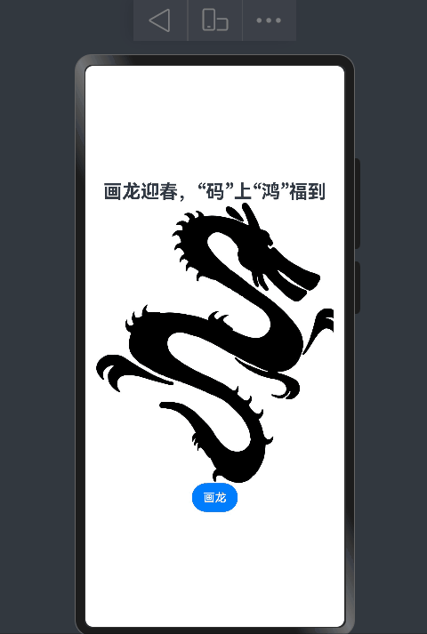

# 【画龙迎春】纯血鸿蒙来画龙！基于HarmonyOS ArkTS来操作SVG图片

大家好，龙年报喜，大地回春，作为程序员，以代码之名，表达对于龙年的祝福。本节将演示如何在基于HarmonyOS ArkTS的Image组件来实现画一条中国龙，祝大家“码”上“鸿”福到！

## 效果演示

手机效果图如下：

B站视频：https://www.bilibili.com/video/BV1Tz421R7Rq/

## 图文介绍

见：https://developer.huawei.com/consumer/cn/forum/topic/0203143920386713714

