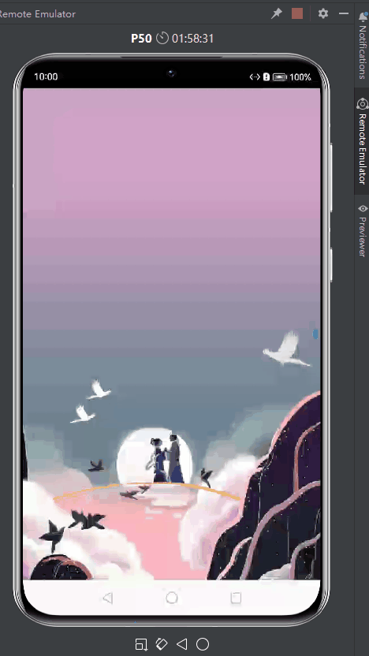

# 七夕壁纸轮播

作为程序员，以代码之名，表达爱。本节将演示如何在基于HarmonyOS ArkUI的SwiperController、Image、Swiper等组件来实现七夕壁纸轮播。

## 效果演示

手机效果图如下：

完整视频演示见：https://www.bilibili.com/video/BV1qh4y1T7dU/

## 图文介绍

见：https://developer.huawei.com/consumer/cn/forum/topic/0209128602919619570?fid=0101591351254000314

