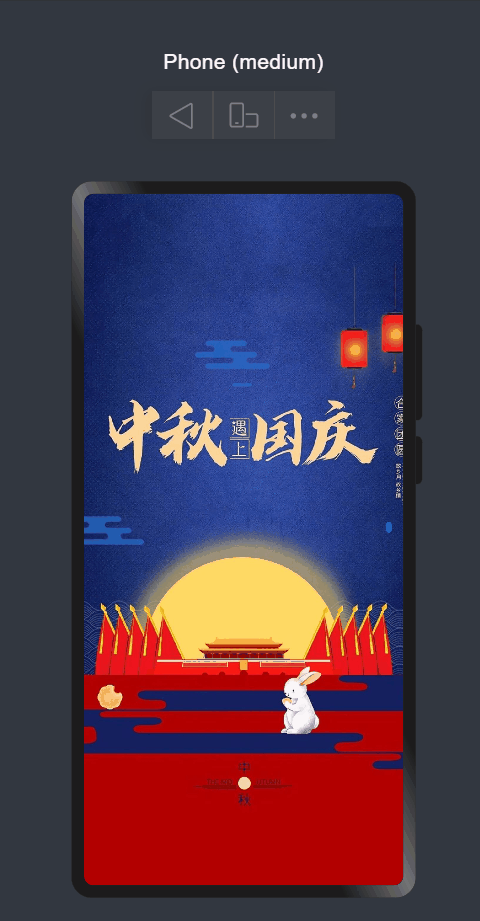

# 基于HarmonyOS ArkTS中秋国庆祝福程序

中秋、国庆双节将至，作为程序员，以代码之名，表达对于阖家团圆的祝福。本节将演示如何在基于HarmonyOS ArkUI的SwiperController、Image、Swiper等组件来实现节日祝福轮播程序。

## 效果演示

手机效果图如下：

## 图文介绍

见：https://developer.huawei.com/consumer/cn/forum/topic/0201131193862897018?fid=0101591351254000314

